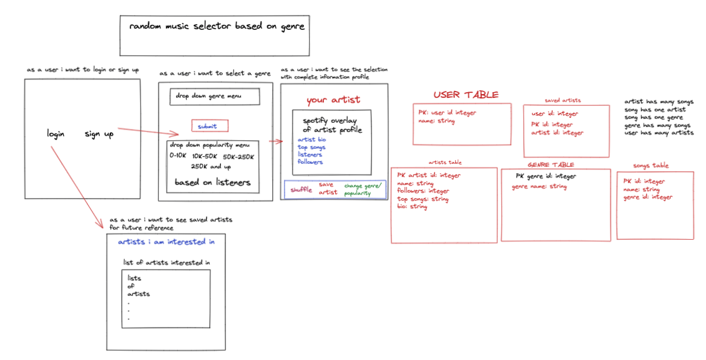

# `Spotify Random Genre`

Click one of the genres to be play a few playlists from that selected genre!
Access website via https://spotify-favorites-random.herokuapp.com/

# `How It Works`
Spotify Random Genre is Node.js Express with Sequelize connected to Postgres database. By clicking on one of the genre photos you will be taken to a page with 
three playlists of each genre. These playlists are embeded from Spotify. By clicking the Spotify icon in the top right corner it will take you to the Spotify
website or app to sign in or start liking the playlist or select songs out of that playlist. 


# `RESTful Routes`
| Method | Route | Purpose |
| ------ | -----------------| ----------- |
| GET | / | Home |
| GET | auth/signup | Signup form |
| GET | auth/login | Login form |
| POST | /auth/signup | Create account on signup |
| GET | /rock | Rock page |
| GET | /rap | Rap page |
| GET | /profile | Profile page |
| GET | /profile/:id/edit | Edit profile |
| PUT | /profile/:id/edit | Submit edits |
| GET | /pop | Pop page |
| GET | /country | Country page |

# `Code Snippets`
Emebed Spotify playlist
```js
 <iframe src="https://open.spotify.com/embed/playlist/37i9dQZF1DX1lVhptIYRda?utm_source=generator"width="100%" height="380" frameBorder="0" allowfullscreen=""
allow="autoplay; clipboard-write; encrypted-media; fullscreen; picture-in-picture"></iframe>
```
